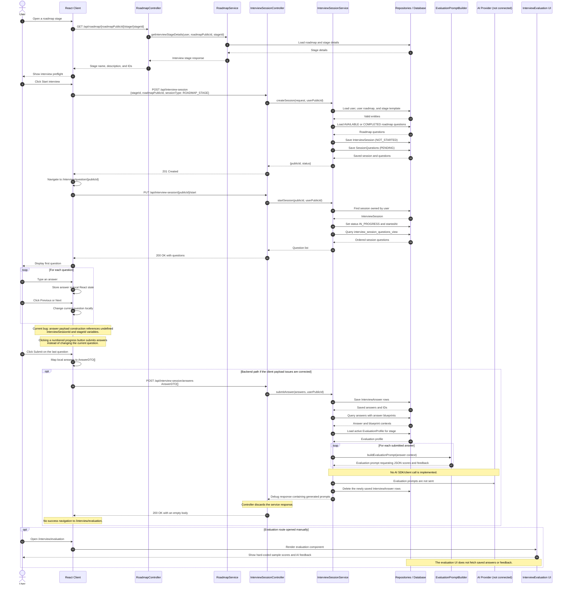

# Interview Sequence Diagram — Current Implementation

## Current implementation status

- Session creation, session start, and question loading are connected from the client to the server and database.
- Typed answers are held in client-side state until submission.
- The server can save answers temporarily, join them with answer blueprints, load an evaluation profile, and construct AI evaluation prompts.
- No AI provider is called, no generated feedback is saved through `InterviewFeedbackRepository`, and the temporary answers are deleted.
- The evaluation page displays static placeholder data rather than backend or AI-generated results.
- The answer-submission path still has client payload issues and does not transition to the evaluation page after success.
