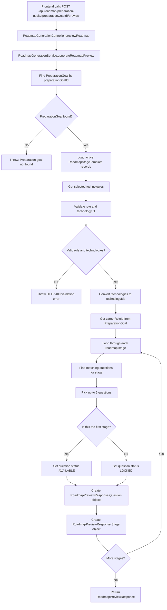
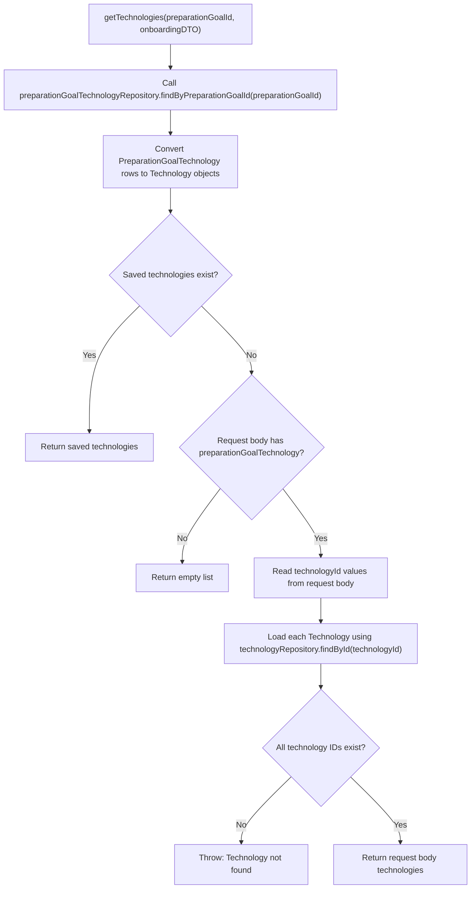
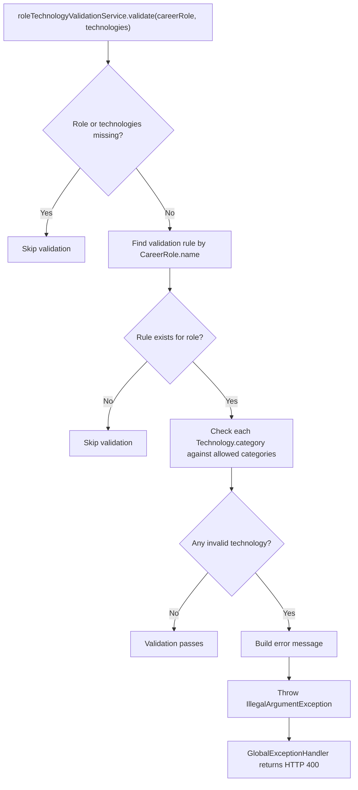
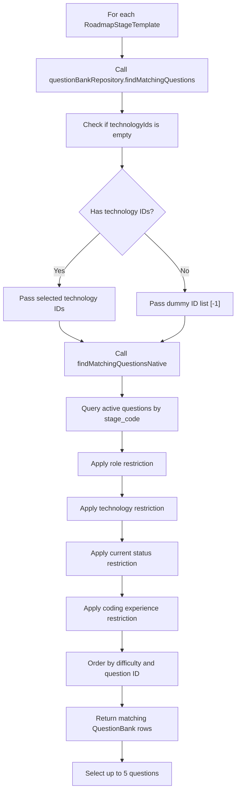
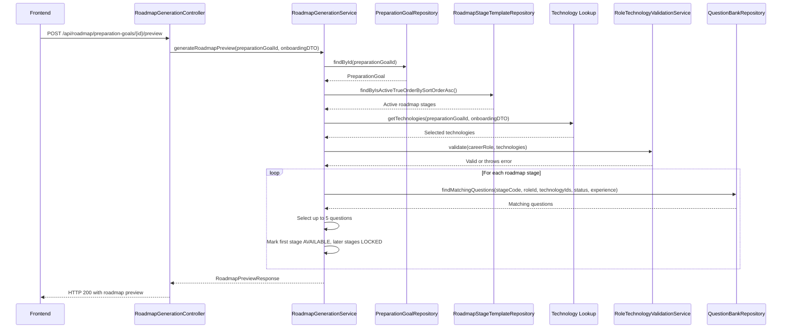
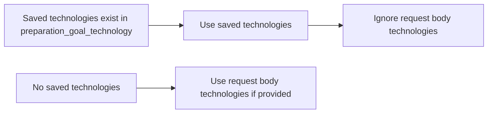

# Roadmap Generation Flow Mermaid

## High-Level Flow

## Technology Selection Flow

## Role And Technology Validation Flow

## Question Matching Flow

## Sequence Diagram

## Saved Technology Priority

