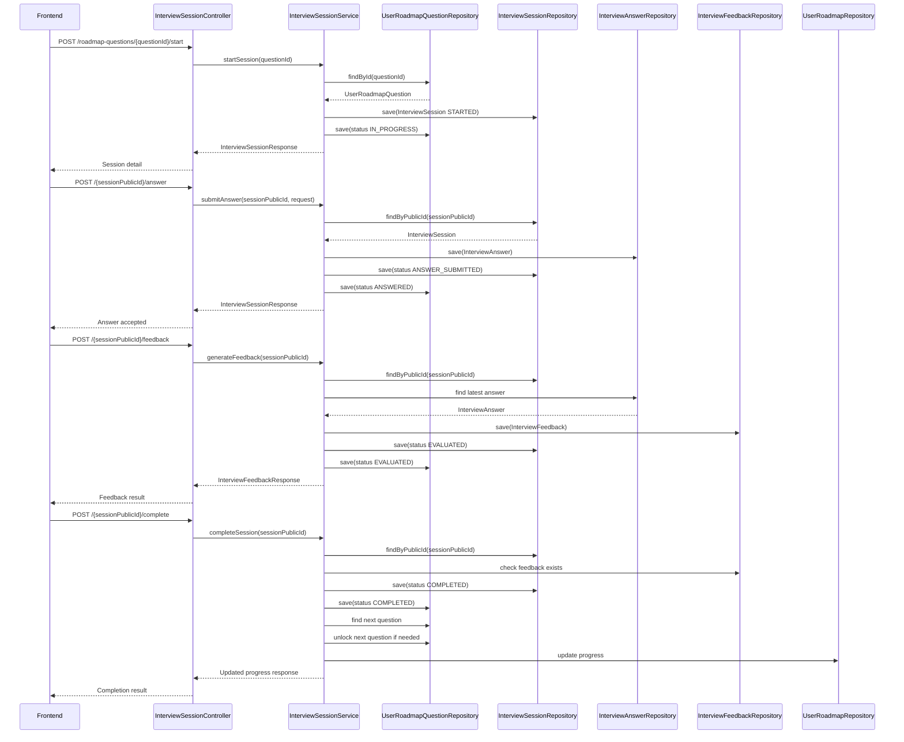

Use only this Mermaid sequence diagram from `src/features/interview/sample.md`:

```mermaid
sequenceDiagram
    participant FE as Frontend
    participant C as InterviewSessionController
    participant S as InterviewSessionService
    participant QR as UserRoadmapQuestionRepository
    participant SR as InterviewSessionRepository
    participant AR as InterviewAnswerRepository
    participant FR as InterviewFeedbackRepository
    participant UR as UserRoadmapRepository

    FE->>C: POST /roadmap-questions/{questionId}/start
    C->>S: startSession(questionId)
    S->>QR: findById(questionId)
    QR-->>S: UserRoadmapQuestion
    S->>SR: save(InterviewSession STARTED)
    S->>QR: save(status IN_PROGRESS)
    S-->>C: InterviewSessionResponse
    C-->>FE: Session detail

    FE->>C: POST /{sessionPublicId}/answer
    C->>S: submitAnswer(sessionPublicId, request)
    S->>SR: findByPublicId(sessionPublicId)
    SR-->>S: InterviewSession
    S->>AR: save(InterviewAnswer)
    S->>SR: save(status ANSWER_SUBMITTED)
    S->>QR: save(status ANSWERED)
    S-->>C: InterviewSessionResponse
    C-->>FE: Answer accepted

    FE->>C: POST /{sessionPublicId}/feedback
    C->>S: generateFeedback(sessionPublicId)
    S->>SR: findByPublicId(sessionPublicId)
    S->>AR: find latest answer
    AR-->>S: InterviewAnswer
    S->>FR: save(InterviewFeedback)
    S->>SR: save(status EVALUATED)
    S->>QR: save(status EVALUATED)
    S-->>C: InterviewFeedbackResponse
    C-->>FE: Feedback result

    FE->>C: POST /{sessionPublicId}/complete
    C->>S: completeSession(sessionPublicId)
    S->>SR: findByPublicId(sessionPublicId)
    S->>FR: check feedback exists
    S->>SR: save(status COMPLETED)
    S->>QR: save(status COMPLETED)
    S->>QR: find next question
    S->>QR: unlock next question if needed
    S->>UR: update progress
    S-->>C: Updated progress response
    C-->>FE: Completion result
```
