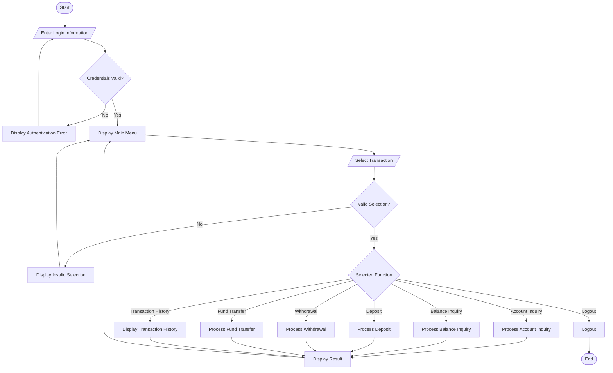

```mermaid
flowchart TD
    A([Start]) --> B[/Enter Login Information/]
    B --> C{Credentials Valid?}

    C -- No --> D[Display Authentication Error]
    D --> B

    C -- Yes --> E[Display Main Menu]
    E --> F[/Select Transaction/]

    F --> G{Valid Selection?}

    G -- No --> H[Display Invalid Selection]
    H --> E

    G -- Yes --> I{Selected Function}

    I -->|Account Inquiry| J[Process Account Inquiry]
    I -->|Balance Inquiry| K[Process Balance Inquiry]
    I -->|Deposit| L[Process Deposit]
    I -->|Withdrawal| M[Process Withdrawal]
    I -->|Fund Transfer| N[Process Fund Transfer]
    I -->|Transaction History| O[Display Transaction History]
    I -->|Logout| P[Logout]

    J --> Q[Display Result]
    K --> Q
    L --> Q
    M --> Q
    N --> Q
    O --> Q

    Q --> E

    P --> R([End])
```